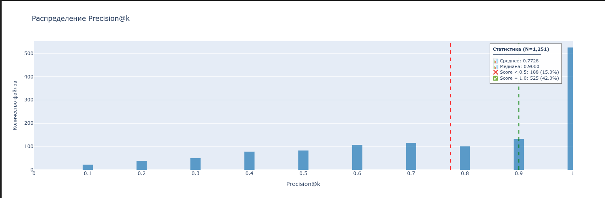
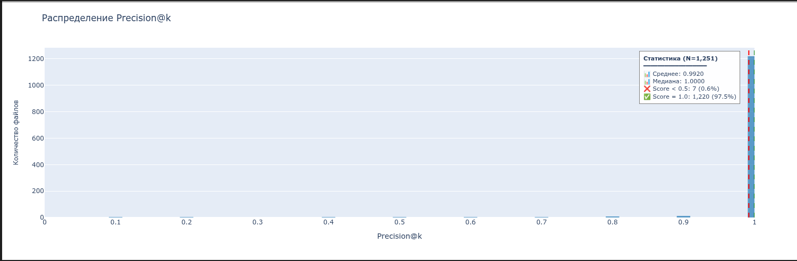
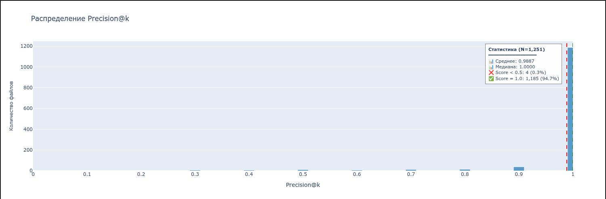

# Dataton_tri_losya_49

## Ветка 

На данной ветке и её дочерних будут проводиться эксперименты по анализу аудио без нейросетевых методов.

## Гипотезы

Возможно извлечь некоторый набор параметров голоса из аудио и передать их на вход некой функции.
По результатам работы этой функции для разных аудио можно будет с некоторой долей уверенности сказать, что на них говорит один и тот же спикер.

## Ход работы

Цель - создании слепка голоса спикера алгоритмическим путём.
Проведя исследование, узнал, что голос характеризуется через `MFCC`.
`MFCC` - 13 чисел, описывающих форму `огибающей спектра` голоса.
Что такое `огибающая спектра`?
Голосовой тракт (рот, гортань) - это фильтр. Он усиливает одни частоты и ослабляет другие. Эта кривая «усиление vs частота» — огибающая. У разных людей она разная (размер рта, форма резонаторов).
`MFCC` вырезает из звука именно эту огибающую, отбрасывая высоту тона (основную частоту), громкость, шумы и микро-детали. Получается `акустический отпечаток` речевого тракта - то, что отличает одного человека от другого. Одинаково даже при разной громкости или фоновом шуме. Но различно для разных звуков. А значит одного такого отпечатка недостаточно, чтобы полностью характеризовать речь одного человека.

### Первая идея
Первая идея состояла в том чтобы определять траекторию речи в пространстве `MFCC` для каждой аудиозаписи. Полученные траектории для одного спикера были относительно похожи друг на друга по размаху и координатам границ. В то время, как траектории других спикеров имели другие границы и размахи.
Основные проблемы такого подхода:
- траектории слишком зависимы от произносимых спикером звуков. Чтобы точно отличать спикеров, нужно, чтобы они произносили одинаковые фразы.
Уже поэтому данный метод не подходит для наших задач.

### Вторая идея

Возникает вопрос: можно ли описать не конкретный путь в пространстве признаков, а всю область, в которой "обитает" голос человека?

#### Как работает `GMM-UBM`

Вместо траекторий строится вероятностная модель распределения MFCC-векторов:
- GMM (смесь гауссиан) описывает, какие комбинации MFCC-признаков характерны для данного спикера
- Каждая гауссиана соответствует типичному звуку (гласная, шипящая и т.д.)
- Совокупность гауссиан покрывает всё разнообразие речи человека

Проблема: для обучения GMM с нуля нужны минуты речи (для хорошего результата 10-60 для каждого спикера).

Решение — `UBM` (Universal Background Model):
- GMM, обученная на сотнях или тысячах разных голосов
- Это модель «среднестатистического человека»
- Для создания слепка конкретного спикера UBM не обучается заново, а адаптируется (MAP-адаптация): центры активных гауссиан слегка сдвигаются под нового человека

Как сравниваются голоса:

- на вход подаются 2 аудиозаписи
- из первой аудиозаписи делается слепок голоса спикера
- из второй аудиозаписи извлекают траекторию MFCC
- Вычисляется `LLR` (Log-Likelihood Ratio) :
```
    LLR = log P(Траектория | Слепок спикера) - log P(Траектория | UBM)
    LLR > 0 — признаки лучше описываются слепком, чем средним человеком → *на обеих записях один спикер*
    LLR < 0 — признаки ближе к среднему человеку, чем к слепку → *на записях разные спикеры*
```

#### Преимущества
- не зависит от произносимого текста
- не зависит от длительности речи
- высокая устойчивость к шуму

#### Недостатки
- метод зависит от того, в каком порядке переданы записи для сравнения. Сравнение ассиметрично.
- слепок голоса довольно большой (вектор размерности ~40 000)
- плохо адаптируется под новые голоса

Я обучил модель UBM на небольшом кусочке train датасета, и она в принципе имеет право на жизнь, показывая не самые худшие результаты.


А также я заметил, что скорость инференса такой модели ниже, чем скорость baseline модели. Разница порядка 40%. Возможно, это из-за того, что все работы проводились на CPU.

### Результаты

Побочным продуктом моих исследований является открытие другой нейросетевой модели для идентификации говорящего. Код для работы с ней представлен [здесь](src/dataton_tri_losya_49/components/embedder/speech_brain.py).
На удивление, даже без дообучения, она показывает результаты на кусочке train датасета выше, чем baseline модель:
speechbrain модель:

baseline модель:


А также результатом работы является обученная [ubm модель](./models/ubm_64.pkl). При необходимости её можно будет дообучить.

### Заключение

Для задачи идентификации спикера всё-таки есть не нейросетевые методы, но пока у меня не получилось догнать с их помощью baseline модель по качеству. Возможно с большим количеством времени и ресурсами для работы можно будет получить более хороший результат.